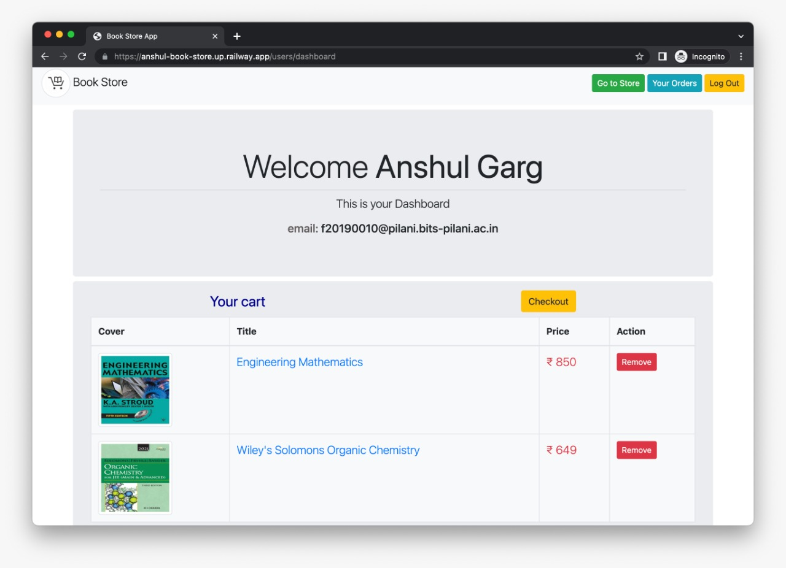

## Book Store Website

This Site is a mini Project using NodeJS and EJS Templating. Which has a Customer Panel and an Admin Panel.

- #### Live Demo [here](https://anshul-book-store.up.railway.app).
  - Test User Credentials
    - Email: `f20190010@pilani.bits-pilani.ac.in`
    - Password: `password`
  - Test Admin Credentials
    - Email: `anshulgarg2002.ag@gmail.com`
    - Password: `password`
  - Test Stripe Card Details
    - Card Number: `4242 4242 4242 4242`
    - Expiry: `Any Future Month`
    - CVV: `Any three Digit Number`
- #### Github Repository [link](https://github.com/4nshulGarg/Book-Store).

---

### Technology and Services used for this Project

1. `Node JS Express Framework` is used as a building Backend part of this Website.
2. `MongoDB` is used to Store Products Details and URL of Photos.
3. `PassportJS` is used for Authentication purpose.
4. `EJS` is used as Template Engine.
5. `Bootstrap` is used for building UI
6. Site has `Admin` functionality by which site owner can add Books to this Store.
7. `Stripe` is used for Payment Gateway.
8. Used `Sendinblue` API for sending Emails.

---

### Website Preview

- 
- 

---

### ADMIN PANEL

- Admin can see all of his Customer and Orders.
- Admin can only edit and delete a product.

- 
- 

---

### Customer Dashboard

- Customer can Comment on a Book.
- Customer can add a book to his Cart.
- Customer buy book in his cart. It also have a Quantity function. He can Buy More than one book of Same Type.
- Customer get a mail when his order is successful and when he registered on this Web

- 
- 

---

### Email Notification

- 
- 
